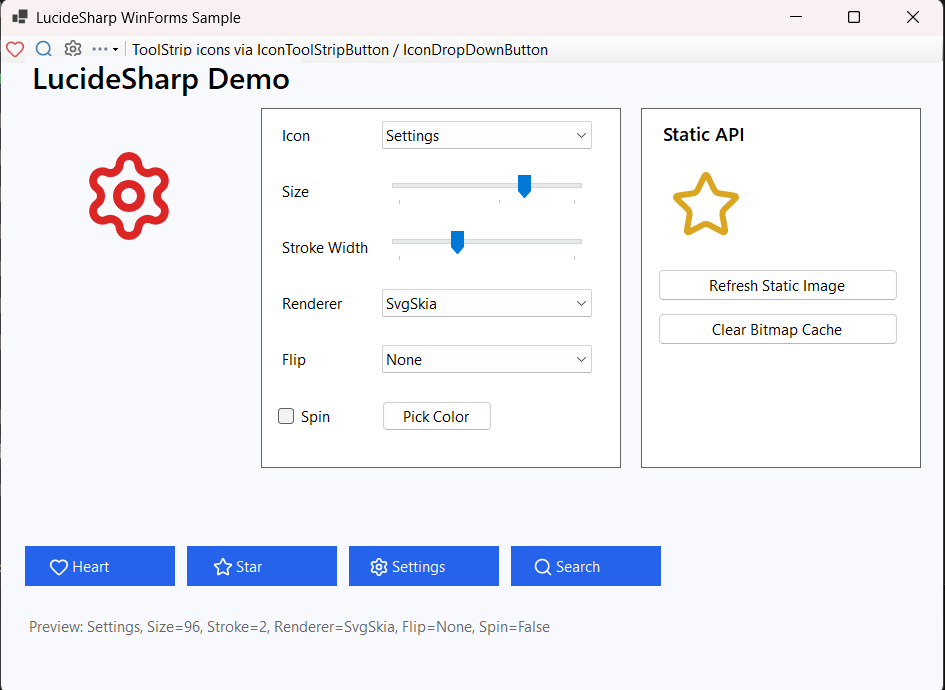

# LucideSharp

Beautiful [Lucide](https://lucide.dev/) SVG icons for Windows Forms — inspired by FontAwesome.Sharp, powered by SkiaSharp.

LucideSharp makes it easy to use 1,700+ Lucide icons in WinForms apps with a designer-friendly `LucideIcon` control, `IconButton` / `IconToolStripButton` / `IconDropDownButton` for forms and toolbars, static rendering helpers, smart bitmap caching, and two SVG render engines.



## Features

- **Strongly typed icons** via the `LucideKind` enum
- **`LucideIcon` control** with full Visual Studio designer support
- **`IconButton`** — FontAwesome.Sharp-style button with Lucide icons
- **`IconToolStripButton`** — FontAwesome.Sharp-style tool strip button with Lucide icons
- **`IconDropDownButton`** — FontAwesome.Sharp-style tool strip drop-down button with Lucide icons
- **Static helpers** for bitmaps, images, and preconfigured controls
- **High-quality rendering** using **Svg.Skia + SkiaSharp** (default)
- **Classic Svg renderer** as an alternative (`RenderEngine.ClassicSvg`)
- **Smart bitmap caching** for excellent runtime performance
- **Theming** — color, size, stroke width, rotation, flip, and smooth spin animation
- **Icon generator tool** to refresh icons from the official Lucide repository

## Installation

```bash
dotnet add package LucideSharp
```

Or in Visual Studio:

```
Install-Package LucideSharp
```

## Quick Start

### LucideIcon control

Drop a `LucideIcon` on your form (from the toolbox after referencing the package), or create one in code:

```csharp
using LucideSharp.WinForms;

var icon = new LucideIcon
{
    Kind = LucideKind.Heart,
    IconSize = 32,
    ForeColor = Color.Crimson,
    StrokeWidth = 2f,
    Location = new Point(12, 12),
    Size = new Size(48, 48)
};

Controls.Add(icon);
```

### IconButton

Drop-in style replacement for FontAwesome.Sharp's `IconButton`:

```csharp
using LucideSharp.WinForms;

var button = new IconButton
{
    Text = "Search",
    Kind = LucideKind.Search,
    IconColor = Color.SteelBlue,
    IconSize = 20,
    TextImageRelation = TextImageRelation.ImageBeforeText
};
```

### IconToolStripButton

Drop-in style replacement for FontAwesome.Sharp's `IconToolStripButton`:

```csharp
using LucideSharp.WinForms;

toolStrip.Items.Add(new IconToolStripButton
{
    Text = "Search",
    Kind = LucideKind.Search,
    IconColor = Color.SteelBlue,
    IconSize = 20,
    DisplayStyle = ToolStripItemDisplayStyle.Image
});
```

### IconDropDownButton

Drop-in style replacement for FontAwesome.Sharp's `IconDropDownButton`:

```csharp
using LucideSharp.WinForms;

var menu = new IconDropDownButton
{
    Text = "More",
    Kind = LucideKind.Ellipsis,
    IconColor = Color.SlateGray,
    IconSize = 20,
    DisplayStyle = ToolStripItemDisplayStyle.Image
};
menu.DropDownItems.Add("Option A");
toolStrip.Items.Add(menu);
```

These button controls share the same property mapping from FontAwesome.Sharp:

| FontAwesome.Sharp | LucideSharp |
|-------------------|-------------|
| `IconChar` | `Kind` (`LucideKind`) |
| `IconColor` | `IconColor` |
| `IconSize` | `IconSize` |
| `IconFont` | *(omit — Lucide has no font styles)* |
| `Flip` / `Rotation` | `Flip` / `Rotation` |

Icon names do not always match FontAwesome one-to-one; pick the closest `LucideKind`.

### Static API

```csharp
using LucideSharp.WinForms;

// Bitmap for buttons, picture boxes, etc.
var bitmap = Lucide.GetBitmap(LucideKind.Settings, 24, Color.DimGray);

// Image for ToolStrip, ImageList, etc.
toolStripButton.Image = Lucide.GetImage(LucideKind.Search, 20, Color.SteelBlue);

// Preconfigured control
var spinner = Lucide.GetIcon(LucideKind.LoaderCircle, 32, Color.DodgerBlue, spin: true);
Controls.Add(spinner);
```

## Customization

### Change icon, color, and size

```csharp
icon.Kind = LucideKind.Star;
icon.ForeColor = Color.Gold;
icon.IconSize = 48;
icon.StrokeWidth = 1.5f;
```

### Rotation and flipping

```csharp
icon.Rotation = 45f;
icon.Flip = FlipMode.Horizontal;
```

### Spinning animation

```csharp
icon.Kind = LucideKind.LoaderCircle;
icon.Spin = true;
```

### Switch render engines

```csharp
// Recommended — best quality and performance
icon.RenderEngine = RenderEngine.SvgSkia;

// Alternative — classic Svg.NET renderer
icon.RenderEngine = RenderEngine.ClassicSvg;
```

### Clear the bitmap cache

```csharp
Lucide.ClearCache();
```

## Updating the Icon Set

LucideSharp ships with embedded SVG data generated from the official [lucide-icons/lucide](https://github.com/lucide-icons/lucide) repository.

To refresh to the latest icons:

```bash
dotnet run --project tools/IconGenerator
```

Options:

```bash
dotnet run --project tools/IconGenerator -- --output src/LucideSharp.WinForms
dotnet run --project tools/IconGenerator -- --repo lucide-icons/lucide --branch main
```

This regenerates:

- `src/LucideSharp.WinForms/LucideKind.cs`
- `src/LucideSharp.WinForms/Data/LucideIconData.cs`

## Dependencies

| Package | Purpose |
|---------|---------|
| [Svg.Skia](https://www.nuget.org/packages/Svg.Skia) | Default high-quality SVG renderer |
| [SkiaSharp](https://www.nuget.org/packages/SkiaSharp) | Transitive dependency of Svg.Skia |
| [Svg](https://www.nuget.org/packages/Svg) | Optional classic renderer |

**SkiaSharp notes:**

- SkiaSharp includes native binaries for Windows, macOS, and Linux.
- For Linux deployments, ensure the appropriate `SkiaSharp.NativeAssets.*` package matches your runtime.
- LucideSharp targets `net8.0-windows`, `net6.0-windows`, and `net48`.

## Build and Pack

### Build the solution

```bash
dotnet build LucideSharp.slnx
```

### Create the NuGet package

```bash
dotnet pack src/LucideSharp.WinForms/LucideSharp.WinForms.csproj -c Release -o ./artifacts
```

The package is written to `./artifacts/LucideSharp.<version>.nupkg` (for example `LucideSharp.1.0.2.nupkg`).

### Publish to nuget.org

```bash
dotnet nuget push ./artifacts/LucideSharp.1.0.2.nupkg --api-key <YOUR_API_KEY> --source https://api.nuget.org/v3/index.json
```

## Continuous Integration

GitHub Actions automatically builds and packs the library on every push to `main` and on pull requests. Publishing to [nuget.org](https://www.nuget.org) is triggered when you push a version tag.

### Setup

1. Create an API key at [nuget.org/account/apikeys](https://www.nuget.org/account/apikeys) with **Push** scope for package `LucideSharp`.
2. Add it as a repository secret named `NUGET_API_KEY` (**Settings → Secrets and variables → Actions**).

### Release workflow

```bash
# Bump version in src/LucideSharp.WinForms/LucideSharp.WinForms.csproj, commit, then:
git tag v1.0.2
git push origin v1.0.2
```

The workflow (`.github/workflows/ci.yml`) will:

1. Build the full solution on `windows-latest` (required for WinForms + net48)
2. Pack `LucideSharp` with the tag version (e.g. `v1.0.2` → package version `1.0.2`)
3. Upload `.nupkg` and `.snupkg` artifacts
4. Publish both packages to nuget.org

You can also trigger a build manually from the **Actions** tab via **workflow_dispatch**.

## Sample Application

```bash
dotnet run --project samples/WinFormsSample
```

The sample demonstrates:

- Live `LucideIcon` preview with size, color, stroke, flip, spin, and renderer switching
- Static `Lucide.GetImage()` usage
- `IconButton`, `IconToolStripButton`, and `IconDropDownButton` integration
- Cache clearing

## Project Structure

```
LucideSharp/
├── src/LucideSharp.WinForms/     # Main library (NuGet package: LucideSharp)
│   └── Controls/                 # LucideIcon, IconButton, IconToolStripButton, IconDropDownButton
├── tools/IconGenerator/         # Downloads Lucide icons and regenerates enum/data
├── tools/SymbolValidator/       # Validates NuGet symbol packages in CI
├── samples/WinFormsSample/      # Demo application
├── assets/screenshots/          # README screenshots
├── .github/workflows/ci.yml     # Build, pack, and publish
└── README.md
```

## License

MIT — see [LICENSE](LICENSE).

Lucide icons are licensed under the [ISC License](https://github.com/lucide-icons/lucide/blob/main/LICENSE).